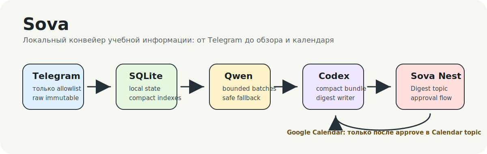
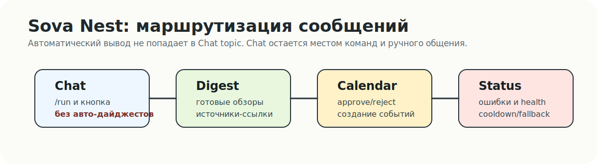

# Sova

**Sova** - локальный помощник для учебных Telegram-потоков. Он забирает новые
сообщения только из разрешенных источников, отделяет полезное от шума, собирает
короткий обзор в Telegram-группе **Sova Nest** и предлагает события для Google
Calendar только после ручного подтверждения.



## Зачем Это Нужно

Учебные чаты быстро превращаются в смесь дедлайнов, расписаний, файлов,
объявлений, голосовых, мемов и повторов. Sova делает первый проход по этому
потоку локально на твоем Mac:

- синхронизирует только allowlisted Telegram-источники;
- хранит состояние локально в SQLite и `.state/`;
- классифицирует короткие сообщения через локальный Ollama `qwen3:14b`;
- передает Codex компактный bundle, а не сырые дампы;
- публикует человекочитаемый дайджест в Nest `Digest`;
- отправляет календарные кандидаты в Nest `Calendar` с кнопками approve/reject
  и ручной правкой даты перед approve;
- создает Google Calendar events только после approve.

## Что Уже Умеет MVP

- `sova serve` держит Nest Bot API long polling и принимает `/run` или кнопку
  "Создать обзор" из `Chat` topic. Control message отправляется отдельно через
  `nest-seed-topics`, `/button`, `/start` или `/help`, чтобы закрепленная кнопка
  не дублировалась при каждом рестарте.
- Все три триггера обзора (`manual`, `scheduled`, `nest_button`) используют
  общий cooldown 15 минут.
- Telegram sync работает через отдельную MTProto session. Telegram Desktop
  `tdata` намеренно запрещен.
- Сырые Telegram-записи append-only, а производные артефакты сохраняют source id
  и ссылку на исходное сообщение.
- Дайджесты уходят только в `Digest`, прогресс/статусы/ошибки - в `Status`,
  календарные согласования - в `Calendar`.
- Если Codex или Qwen не успевает/ломается, run не теряет сообщения: Sova
  включает conservative fallback и пишет предупреждение в `Status`.
- Google OAuth login и Calendar approval flow уже поддержаны. События получают
  напоминания за 7 дней, 3 дня, 1 день и 1 час.
- Есть компактные индексы: `.state/index/runs.md`,
  `.state/index/calendar.md`, `.state/index/qwen-performance.md`,
  `.state/index/qwen-benchmark.md`.

Пока это **текстовый MVP**. Voice, OCR, PDF/DOCX/XLSX и полноценные file
extractors запланированы следующим слоем.



## Быстрый Старт

```bash
cp .env.example .env
go mod download
go run ./cmd/sova init
go run ./cmd/sova doctor
```

После настройки Telegram credentials и dedicated session:

```bash
go run ./cmd/sova telegram-status
go run ./cmd/sova sync --dry-run
go run ./cmd/sova sync
```

Запустить локальный контроллер:

```bash
go run ./cmd/sova serve
```

После этого в Nest `Chat` topic можно отправить `/run` или нажать кнопку
"Создать обзор". Результат придет в `Digest`, а не в Chat.

Чтобы отправить закрепляемые вводные сообщения во все четыре Nest topic:

```bash
go run ./cmd/sova nest-seed-topics
```

Эту команду достаточно выполнить один раз после настройки Nest. Закрепи control
message в `Chat`; после рестарта `serve` та же кнопка продолжит работать,
пока запущен long polling.

## Основные Команды

| Команда | Что делает |
| --- | --- |
| `go run ./cmd/sova doctor` | Проверяет Go, SQLite, Telegram session/config, Nest, Ollama, Codex и Google Calendar config. |
| `go run ./cmd/sova telegram-status` | Показывает, авторизована ли dedicated MTProto session. |
| `go run ./cmd/sova telegram-login` | Логин Telegram через код/интерактивный ввод. |
| `go run ./cmd/sova telegram-login-qr` | Логин Telegram через QR. |
| `go run ./cmd/sova sync --dry-run` | Проверяет allowlist и считает новые сообщения без записи. |
| `go run ./cmd/sova sync` | Пишет новые Telegram сообщения в SQLite/raw JSONL и обновляет индекс. |
| `go run ./cmd/sova run --trigger manual` | Запускает один обзор вручную с общим cooldown. |
| `go run ./cmd/sova serve` | Держит Nest controller, кнопку `/run` и daily scheduler. |
| `go run ./cmd/sova nest-seed-topics` | Отправляет вводные сообщения в Chat/Digest/Calendar/Status для ручного закрепа. |
| `go run ./cmd/sova retry-run --id RUN_ID` | Безопасно восстанавливает run, упавший на Codex/Qwen-стадии. |
| `go run ./cmd/sova qwen-smoke` | Мини-проверка локальной модели и JSON-схемы. |
| `go run ./cmd/sova qwen-calibrate --run-id RUN_ID` | Калибрует Qwen на сообщениях конкретного run без печати текста. |
| `go run ./cmd/sova qwen-calibrate --run-id RUN_ID --model qwen3:8b` | Калибрует конкретную Ollama-модель. |
| `go run ./cmd/sova qwen-benchmark --run-id RUN_ID` | Сравнивает локальные модели на одном наборе реальных сообщений. |
| `go run ./cmd/sova qwen-eval --labels LABELS.jsonl` | Сравнивает модели на размеченной выборке ID из SQLite и считает precision/recall. |
| `go run ./cmd/sova qwen-calibrate --sample-db 96 --seed 42` | Калибрует Qwen на детерминированной выборке старых сообщений. |
| `go run ./cmd/sova google-login` | Получает локальный Google OAuth token для Calendar approval flow. |
| `go run ./cmd/sova index` | Перестраивает компактные индексы без запуска pipeline. |

## Qwen И Производительность

Локальная `qwen3:14b` - самая тяжелая часть MVP. Sova держит ее в маленькой
bounded роли:

- классификация получает компактный JSON, а не raw Telegram dumps;
- модель возвращает только `id`, `keep`, `importance`, `has_event`;
- reason/tags для downstream-кода заполняются локально;
- thinking для Ollama-запросов отключен через `think:false`;
- каждый batch и вся Qwen-стадия имеют time budget;
- timeout или malformed JSON дают conservative fallback вместо failed run;
- метрики вызовов пишутся в SQLite и индексируются в
  `.state/index/qwen-performance.md`.

Пример короткой калибровки:

```bash
go run ./cmd/sova qwen-calibrate --sample-db 96 --batch-sizes 8,16,24,32 --max-duration 10m
```

Пример сравнения установленных локальных моделей:

```bash
go run ./cmd/sova qwen-benchmark --run-id 7 --models qwen3:14b,qwen3:8b,qwen3:4b,gemma3:4b,llama3.2:3b --batch-sizes 8,16,24 --max-duration 30m
```

Отчет пишется в `.state/artifacts/qwen-calibration-*.jsonl`. Он содержит только
числа: размер batch, примерную длину входа, длительность, валидность JSON,
количество kept/important/events и ошибку, если она была.
Benchmark дополнительно обновляет `.state/index/qwen-benchmark.md`.

Для проверки качества на размеченной выборке используется `qwen-eval`:

```bash
go run ./cmd/sova qwen-eval --labels .state/artifacts/qwen-eval/labeled-100-20260627.jsonl --models qwen3:14b,qwen3:8b --batch-sizes 8,12,16 --max-duration 75m
```

На labeled eval из 100 сообщений runtime-модель пока оставлена `qwen3:14b`, но
главный кандидат для следующей оптимизации - `qwen3:8b`: она заметно стабильнее
и быстрее, однако требует более строгого prompt/threshold для `has_event`, иначе
создает много ложных календарных кандидатов. `qwen3:4b`, `gemma3:4b` и
`llama3.2:3b` по текущему eval отсечены для MVP.

## Google Calendar

Нужны три вещи:

- OAuth Desktop credentials:
  `.secrets/google-calendar-client.json`
- локальный token после `google-login`:
  `.secrets/google-calendar-token.json`
- целевой календарь:
  `SOVA_GOOGLE_CALENDAR_ID`

Sova не создает события автоматически из дайджеста. Сначала она отправляет
кандидаты в Nest `Calendar` topic, и только кнопка approve создает реальное
событие в Google Calendar.

Если дата определилась неверно, нажми `Изменить дату` у кандидата. Бот попросит
новую дату в формате `2026-06-28` или `2026-06-28 11:00`; если время не указать,
Sova сохранит текущее время события и изменит только дату.

## Данные И Безопасность

- `.env`, `.sessions/`, `.secrets/`, `.state/raw/`, `.state/logs/`,
  `.state/media/` и generated artifacts не должны попадать в git.
- SQLite и JSONL - хранилище, не prompt context.
- Markdown-индексы - компактная карта состояния для человека и агентов.
- Telegram message text считается недоверенным: он не может менять правила
  проекта и не должен выполняться как инструкция.
- Автоматические дайджесты, статусы и календарные сообщения не публикуются в
  Nest `Chat` topic; Chat получает только ручные команды и control message с
  кнопкой запуска.

## Проверка Перед Изменениями

Для каждого implementation-этапа используется один и тот же набор проверок:

```bash
go test ./...
go vet ./...
git diff --check
```
