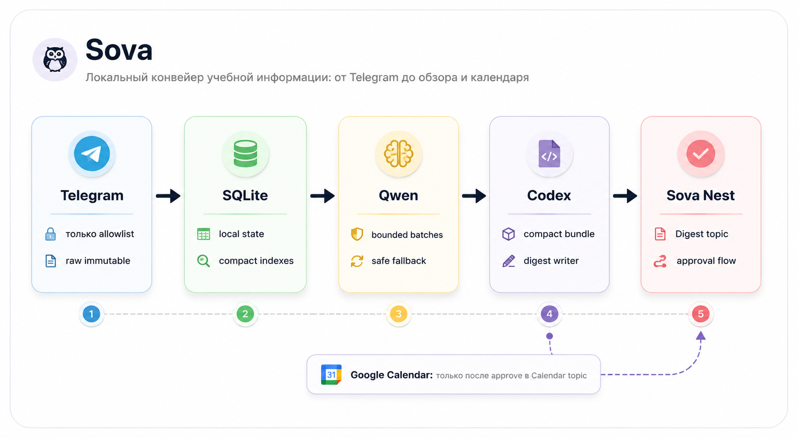
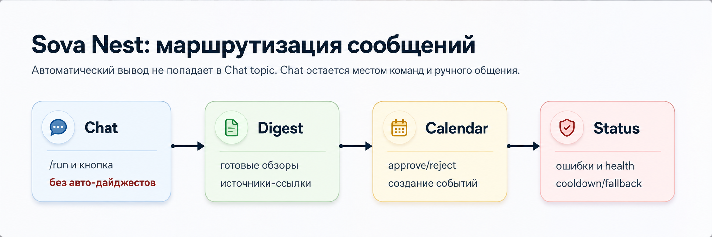

# Sova

**Sova** - локальный ассистент для академических и учебных Telegram-потоков. Он
собирает новые сообщения только из разрешенных источников, отделяет полезное от
информационного шума, публикует краткие дайджесты в Telegram-группе **Sova
Nest** и помогает планировать события в Google Calendar после подтверждения
пользователем.



## Для чего это нужно

Учебные чаты быстро переполняются сообщениями о дедлайнах, изменениях в
расписании, файлах, объявлениях и обычных обсуждениях. Sova помогает
структурировать этот поток информации, сохраняя состояние локально и выполняя
ограниченную первичную обработку через настроенный Google API:

- безопасно синхронизирует только учебные источники из
  `SOVA_NEST_TELEGRAM_ALLOWED_CHATS`;
- хранит состояние приложения локально в SQLite и директории `.state/`;
- классифицирует короткие сообщения и извлекает календарные события через
  последовательный маршрут Google-моделей с локальным безопасным fallback;
- передает Gemini компактный очищенный bundle, а не громоздкие raw dumps;
- публикует понятные обзоры в топике `Digest` группы Nest;
- отправляет календарные кандидаты в `Calendar` с кнопками approve/reject и
  ручной правкой даты перед подтверждением;
- создает события в Google Calendar только после approve.

Истёкший access token обновляется автоматически, пока действителен refresh token.
Если Google отозвал доступ (`invalid_grant`) или refresh token отсутствует,
запустите `sova google-login` с теми же OAuth credentials и аккаунтом. Для
серверной установки авторизуйтесь на машине с браузером, затем безопасно
перенесите полученный token в путь `SOVA_GOOGLE_TOKEN_PATH`, используемый сервисом,
с правами `0600` и владельцем сервиса. Каталог токена также должен быть доступен
сервису для записи: обновление сохраняется атомарной заменой файла. Локальный вход сам по себе не обновляет
серверный token. После этого снова нажмите Approve на исходной карточке:
сохранённый ID события позволяет повторить попытку без создания дубликата.
Не публикуйте token или OAuth credentials в Telegram и логах.
Если OAuth-приложение имеет статус External / Testing, refresh token для Calendar
истекает через семь дней. Перед постоянной эксплуатацией завершите Branding и
переведите приложение в Production, затем пройдите авторизацию заново.
[Правила Google о сроках токенов](https://developers.google.com/identity/protocols/oauth2#expiration).

## Текущие возможности MVP

- `sova serve` запускает long polling для Nest Bot API. Бот принимает текстовые
  команды вроде `/run` в служебном топике `Status` и нажатие закрепленной кнопки
  `Создать обзор` в учебном топике `Chat`.
- Управляющее сообщение с кнопкой создается отдельно через `nest-seed-topics`,
  `/button`, `/start` или `/help`, поэтому закрепленная кнопка не дублируется
  при каждом перезапуске `serve`.
- Все три триггера обзора (`manual`, `scheduled`, `nest_button`) используют
  общий cooldown 15 минут.
- Ежедневный `scheduled`-запуск можно выключить и снова включить прямо в
  `Status` командами `/daily off` и `/daily on`; `/daily status` показывает
  текущее состояние. Настройка хранится в SQLite и переживает перезапуск, а
  ручной `/run` и кнопка `Создать обзор` продолжают работать.
- Telegram sync работает через выделенную MTProto session. Импорт Telegram
  Desktop `tdata` намеренно запрещен.
- Сырые Telegram-записи сохраняются append-only. Все производные документы и
  отчеты содержат source id и прямую ссылку на исходное сообщение.
- Дайджесты публикуются только в `Digest`; команды, прогресс, статусы и ошибки
  уходят в `Status`; запросы на подтверждение календарных событий приходят в
  `Calendar`; `Chat` остается местом учебных материалов и ручного общения.
- Если Gemini или другие Google-модели работают медленно или временно недоступны, Sova не теряет
  сообщения: включается conservative fallback, данные сохраняются, а
  предупреждение отправляется в `Status`.
- Google OAuth login и Calendar approval flow уже поддержаны. Для созданных
  событий настраиваются напоминания за 7 дней, 3 дня, 1 день и 1 час.
- Для навигации по состоянию есть компактные индексы:
  `.state/index/runs.md`, `.state/index/calendar.md`,
  `.state/index/model-performance.md`, `.state/index/qwen-performance.md`
  (временный совместимый alias), а также исторические Qwen benchmark/eval.

Пока это **текстовый MVP**. Voice, OCR, PDF/DOCX/XLSX и специализированные file
extractors запланированы следующим слоем.



## Быстрый старт

Скопируйте шаблон конфигурации и установите зависимости:

```bash
cp .env.example .env
go mod download
```

Инициализируйте окружение и проверьте зависимости:

```bash
go run ./cmd/sova init
go run ./cmd/sova doctor
```

После настройки Telegram credentials и выделенной MTProto session проверьте
авторизацию и синхронизацию:

Учебные источники для дайджеста указываются в
`SOVA_NEST_TELEGRAM_ALLOWED_CHATS`. Личную Workspace-группу держите отдельно в
`SOVA_WORKSPACE_LEGACY_SOURCE` или других `SOVA_WORKSPACE_*` переменных, чтобы
она не попадала в учебный обзор.

```bash
go run ./cmd/sova telegram-status
go run ./cmd/sova sync --dry-run
go run ./cmd/sova sync
```

Запустите локальный контроллер:

```bash
go run ./cmd/sova serve
```

После этого в служебном топике `Status` можно отправить `/run` или управлять
ежедневным запуском через `/daily on|off|status`, а в учебном топике `Chat`
можно нажать закрепленную кнопку `Создать обзор`. Готовый результат будет
отправлен в `Digest`, а не в `Chat`.

Чтобы отправить приветственные сообщения во все четыре топика Nest, выполните:

```bash
go run ./cmd/sova nest-seed-topics
```

Эту команду достаточно выполнить один раз после настройки Nest. Закрепите
управляющее сообщение в `Chat`: та же кнопка продолжит работать после
перезапусков `serve`, пока активен long polling. Текстовые команды
`/run`, `/daily on|off|status`, `/button` и `/help` отправляйте в `Status`.

## Список основных команд

| Команда | Описание |
| --- | --- |
| `go run ./cmd/sova doctor` | Проверяет SQLite, серверные пути, Telegram/Nest/Workspace, Google model route и Google Calendar config без требований к Go toolchain, Ollama или Codex CLI. |
| `go run ./cmd/sova telegram-status` | Показывает, авторизована ли выделенная MTProto session. |
| `go run ./cmd/sova telegram-login` | Запускает интерактивную авторизацию в Telegram по коду. |
| `go run ./cmd/sova telegram-login-qr` | Запускает авторизацию в Telegram через QR. |
| `go run ./cmd/sova sync --dry-run` | Проверяет учебный Nest allowlist и считает новые сообщения без записи в БД. |
| `go run ./cmd/sova sync` | Записывает новые Telegram сообщения в SQLite/raw JSONL и обновляет индекс. |
| `go run ./cmd/sova run --trigger manual` | Запускает один обзор вручную с проверкой общего cooldown. |
| `/daily on`, `/daily off`, `/daily status` | Включает, выключает или показывает только ежедневный автозапуск; ручные триггеры не отключаются. |
| `go run ./cmd/sova serve` | Запускает локальный Nest controller для команд в `Status`, кнопки в `Chat` и daily scheduler. |
| `go run ./cmd/sova workspace serve` | Запускает отдельный Workspace bot для `InSync v1.0`: clusters, edit-sync, task cards и Stage 6 document commands. |
| `go run ./cmd/sova serve-all` | Запускает Nest и Workspace в одном процессе; основной режим для alwaysdata Free. |
| `go run ./cmd/sova healthcheck` | Проверяет свежий heartbeat живого `serve-all` и существующую SQLite DB без Gemini-запроса. |
| `/doc new`, `/doc append`, `/doc publish` | Команды заметок: source берётся из `Заметки` или reply, preview публикации уходит в `Inbox`, approve публикует в `Полезное`. |
| `/template new`, `/template append`, `/template type` | Команды заготовок: новый шаблон спрашивает тип, типы хранятся в индексе и могут быть переименованы/архивированы. |
| `/collection new`, `/collection add`, `/collection show` | Команды коллекций: создают отдельную карточку коллекции и один общий индекс ссылок на коллекции. |
| `go run ./cmd/sova workspace seed-topic-pins --target all` | Отправляет human-friendly сообщения для закрепления в топики `InSync v1.0` и `Sova.Control`. |
| `go run ./cmd/sova workspace seed-command-help` | Создаёт и закрепляет отслеживаемую справку по командам в каждом Workspace topic; повторный запуск обновляет те же сообщения. |
| `go run ./cmd/sova workspace seed-document-indexes` | Создаёт или обновляет active indexes; `--type quote` затрагивает только закреплённый индекс цитат в `Опыт`. |
| `go run ./cmd/sova workspace cleanup-test-tasks --execute` | Удаляет bot-created тестовые task cards/backlog и помечает найденные проверочные задачи отменёнными. |
| `go run ./cmd/sova workspace search-index --full-scan` | Строит semantic index нового InSync, старого InSync и Sova.Nest перед включением `/search`. |
| `/quote`, `/quote show`, `/quote edit` | Создают, показывают и безопасно изменяют из Inbox цитаты для «Опыт»; автор оформляется курсивом, индекс обновляется на месте. |
| `/search <запрос>` | Ищет из Inbox одновременно по трём источникам и возвращает до 10 прямых ссылок. |
| `go run ./cmd/sova version` | Показывает встроенные версию и git commit. |
| `go run ./cmd/sova workspace announce-release` | Показывает dry-run релизного сообщения; `--execute` требует deployment receipt того же commit. |
| `go run ./cmd/sova nest-seed-topics` | Отправляет стартовые сообщения в `Chat`, `Digest`, `Calendar`, `Status` для ручного закрепления. |
| `go run ./cmd/sova retry-run --id RUN_ID` | Без повторной синхронизации восстанавливает совместимый run после ошибки Google-модели, Gemini digest или подтверждённой ошибки публикации. |
| `go run ./cmd/sova resolve-publication ...` | После ручной сверки разрешает неоднозначную доставку Nest как `sent` либо `retry`; автоматически неизвестный исход не пересылается. |
| `go run ./cmd/sova model-smoke --all` | Проверяет доступность и структурированный ответ всех Google-моделей маршрута, включая финальный Gemini digest, без сравнительного benchmark. |
| `go run ./cmd/sova qwen-smoke` | Временная совместимая команда для локального Qwen tooling; production Nest её не использует. |
| `go run ./cmd/sova qwen-calibrate --run-id RUN_ID` | Калибрует Qwen на сообщениях конкретного запуска без вывода текста. |
| `go run ./cmd/sova qwen-calibrate --run-id RUN_ID --model qwen3:8b` | Калибрует альтернативную локальную Ollama-модель. |
| `go run ./cmd/sova qwen-benchmark --run-id RUN_ID` | Сравнивает производительность локальных моделей на одном наборе реальных сообщений. |
| `go run ./cmd/sova qwen-eval --labels LABELS.jsonl` | Оценивает качество классификации на размеченной выборке ID из SQLite с расчетом precision/recall. |
| `go run ./cmd/sova qwen-calibrate --sample-db 96 --seed 42` | Калибрует Qwen на фиксированной детерминированной выборке старых сообщений. |
| `go run ./cmd/sova google-login` | Получает локальный Google OAuth token для Calendar approval flow. |
| `go run ./cmd/sova index` | Перестраивает компактные markdown-индексы без запуска pipeline. |

## Настройка моделей Nest

Production Nest использует `SOVA_GEMINI_API_KEY` и последовательность из
`SOVA_NEST_GOOGLE_MODELS`. По умолчанию модели пробуются в порядке
`gemini-3.5-flash-lite`, `gemma-4-31b-it`, `gemini-3.1-flash-lite`,
`gemma-4-26b-a4b-it`. Для стабильной работы область ответственности моделей
ограничена:

- модель получает строго структурированный компактный JSON, а не полные raw
  Telegram dumps;
- на выходе ожидается только `id`, `keep`, `importance` и `has_event`;
- `reason` и `tags` заполняются локальным Go-кодом после валидации схемы;
- batches разных Telegram-источников не смешиваются, внутри источника сообщения
  идут хронологически и получают непрозрачные ID;
- timeout, `404`, `429`, `5xx` или некорректный JSON переключают запрос на
  следующую модель; полностью отказавшая пачка делится на меньшие;
- окончательный fallback сохраняет все сообщения (`keep-all`) и не создаёт
  календарные события;
- статистика вызовов сохраняется в SQLite и индексируется в
  `.state/index/model-performance.md` без prompt, Telegram-текста и сырого ответа.

Проверка connectivity и JSON-схемы без сравнительной оценки качества:

```bash
go run ./cmd/sova model-smoke --all
```

Подробный контракт маршрута приведён в `docs/model_routing.md`.

Настройка полного и инкрементального поиска описана в
`docs/semantic_search.md`.

### Совместимость локального Qwen

Команды ниже оставлены на один переходный релиз для воспроизводимости старых
калибровок. Production runtime Nest не обращается к Ollama.

Пример быстрой калибровки:

```bash
go run ./cmd/sova qwen-calibrate --sample-db 96 --batch-sizes 8,16,24,32 --max-duration 10m
```

Сравнение текущих локальных кандидатов:

```bash
go run ./cmd/sova qwen-benchmark --run-id 7 --models qwen3:14b,qwen3:8b --batch-sizes 8,16,24 --max-duration 30m
```

Проверка качества на размеченной выборке:

```bash
go run ./cmd/sova qwen-eval --labels .state/artifacts/qwen-eval/labeled-100-20260627.jsonl --models qwen3:14b,qwen3:8b --batch-sizes 8,12,16 --max-duration 75m
```

Исторические результаты Qwen остаются в `docs/model_calibration.md`; они не
определяют новый Google-маршрут и не запускаются как benchmark при релизе.

## Настройка Google Calendar

Для интеграции с календарем нужны три составляющие:

1. OAuth Desktop credentials:
   `.secrets/google-calendar-client.json`
2. Локальный token после `google-login`:
   `.secrets/google-calendar-token.json`
3. Целевой календарь:
   `SOVA_GOOGLE_CALENDAR_ID`

Sova не создает события автоматически из дайджеста. Сначала она предлагает
кандидаты в топике `Calendar`; реальное событие в Google Calendar создается
только после approve.

Если дата или время события распознаны неверно, нажмите `Изменить дату` под
карточкой кандидата. Бот попросит ввести корректные данные в формате
`2026-06-28` или `2026-06-28 11:00`. Если время не указано, Sova изменит только
дату и сохранит исходное время события.

## Безопасность и хранение данных

- `.env`, `.sessions/`, `.secrets/`, `.state/raw/`, `.state/logs/`,
  `.state/media/` и generated artifacts не должны попадать в git.
- SQLite и JSONL используются для хранения состояния и истории, но не
  передаются напрямую в prompt context.
- Markdown-индексы выступают компактной картой состояния для человека и
  агентов.
- Текст сообщений из Telegram считается untrusted input: он не может менять
  правила проекта и не должен выполняться как инструкция.
- Автоматические уведомления, дайджесты и календарные карточки распределяются
  по целевым топикам `Digest`, `Status` и `Calendar`. Топик `Chat` остается
  местом учебных материалов, закрепленной кнопки и ручного общения.

## Проверка перед отправкой изменений

Перед каждым implementation-этапом используется стандартный набор проверок:

```bash
go test ./...
go vet ./...
git diff --check
```
